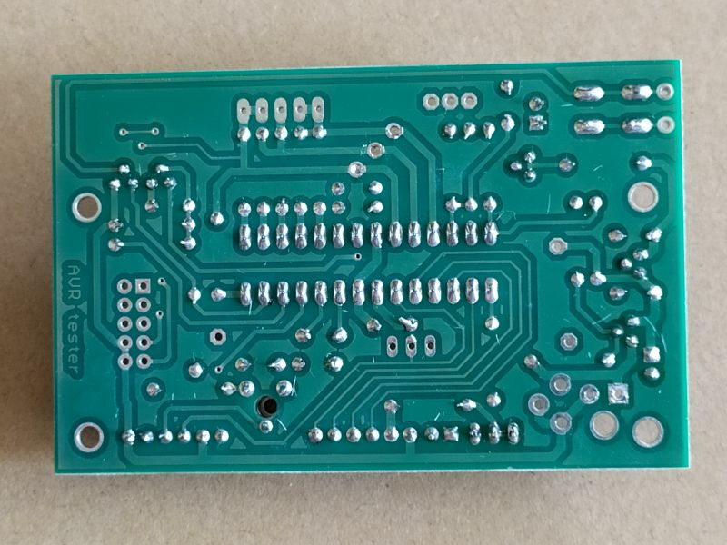
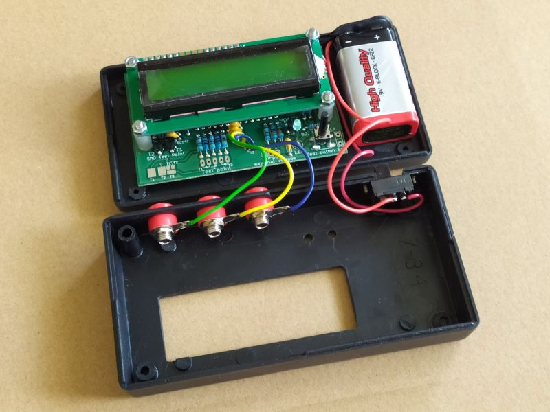

# AVR Tester

#### AVR Tester testuje a měří tyto součástky:
* **Odpory** 0.01R - 50M
* **Kondenzátory** 25pF - 100nF a ESR od hodnot 0.18uF (u tantalů polarita: (-) na pin 1 a (+) na pin 2 / 3 nebo (-) na pin 2 a (+) na pin 3
* **Tranzistory** automatická detekce NPN a PNP, N a P kanálové MOSFET, JFET
* **Tyristory a triaky** měří proudem 6mA, tzn. pouze citlivější součástky, neotevře součástky s větším proudem hradla a darlingy s vnitřními rezistory
* **Diody** a dvojité diody
* **Cívky** 0.01mH - 20H s nižším rozlišením

#### Kalibrace
Připojte ke všem třem výstupům měřící vodiče a spojte je dohromady, zkratujte. Stiskněte a podržte tlačítko na přístroji cca 2 sekundy dokud se neobjeví menu. V něm vyberte kalibraci (test) a potvrďte stisknutím tlačítka. Při kalibraci nemanipulujte s měřícími vodiči. Během kalibrace budete požádáni o zapojení kondenzátoru 100nF - 20uF (mějte ho proto připravený).

 

**Nezapomeňte, že měřené kondenzátory musí být VŽDY před měřením vybité!**

 

Měřenou součástku stačí jen připojit a stisknout tlačítko.
  
#### Fotky hotového výrobku:

